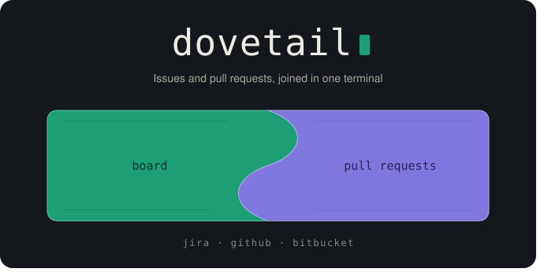

# dovetail — Workflow TUI

[](#)

Terminal UI that joins the pieces of a development workflow in one place: the project board, issues, pull requests — without opening a browser. Backed by GitHub today, with Atlassian (Jira, Bitbucket) and a local spec-driven task board on the way.

## Status

| Area | State |
|---|---|
| GitHub | Working: Projects v2 board, issue and PR overlays with markdown timeline, commits tab, side-by-side Files Changed diff, review mode (draft comments, threads, submit), conversation comments |
| Jira | Project listing in the config dialog only — no issue board yet |
| Bitbucket | Configurable, no API code yet |
| Local task board (`.claude/tasks`) | Specified in [`docs/specs/board/`](./docs/specs/board/), not implemented |

## Install

Not on crates.io yet (depends on `ferrowl-ui` as a git dependency). Build from source with a stable Rust toolchain (pinned by `rust-toolchain.toml`):

```sh
cargo install --path .
# or run directly
cargo run
```

## Usage

Run `dovetail` inside a git repository. On first run the configuration dialog opens; fill in credentials and the repository's board/remote and save with `:w`.

Configuration lives at `$XDG_CONFIG_HOME/dovetail/config.toml` (default `~/.config/dovetail/config.toml`): named credential profiles (`github` token, `jira` base URL/email/token, `bitbucket` username/app password) plus per-repository board and remote sections. Tokens are stored in plaintext — keep the file private.

### Keys

| Key | Action |
|---|---|
| `:` | Command line — `:q` quit, `:config` settings dialog, `:board` / `:remote` switch tab, `:w` write settings, `:reload` |
| `Ctrl+T` then `j`/`k` or digit | Switch tab |
| `Ctrl+R` | Reload the current view |
| `h j k l` / arrows | Move between columns, cards, rows |
| `Enter` | Open the selected issue / pull request |
| `Esc` / `q` | Close the overlay |
| `c` | Comment on the conversation |
| `r`, `[` / `]`, `Ctrl+D` | Review: reply/start a comment, jump between hunks, submit an editor |

## Development

```sh
cargo fmt --check
cargo clippy --all-features --all-targets -- -D warnings
cargo check --all-features
cargo test --all-features
cargo llvm-cov --all-features --fail-under-lines 80
```

See [`CONTRIBUTING.md`](./CONTRIBUTING.md) for the workflow and [`AGENTS.md`](./AGENTS.md) for the agent-facing version of it.

## Documentation

| Document | Contains |
|---|---|
| [`PRD.md`](./PRD.md) | Why this exists, goals, non-goals |
| [`ARCHITECTURE.md`](./ARCHITECTURE.md) | Module map, data flow, concurrency |
| [`docs/specs/`](./docs/specs/) | Authoritative behavior specification |
| [`AGENTS.md`](./AGENTS.md) | Agent workflow and conventions |

## License

[MIT](./LICENSE)
